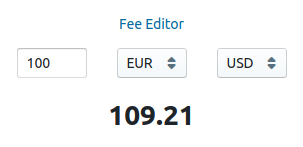

# Currency Calculator



This `README.md` provides full information on how to run this application,
as well as lots of my ideas on overall improvement.

## Quickstart

```
docker-compose up
```

## Run tests

**Backend:**

```
docker-compose up -d fixer-mock
cd backend/
./gradlew test
```

**Frontend:**

```
cd frontend/
yarn test
```

## TODO

Frontend: 

- Introduce state manager (Redux)
  - Remove local state from components, introduce actions to manage state
- Error handling (http client, react rendering, etc.)
- Handle loading state for long-term processes on UI (e.g. API request)
- Add prettier for code style

Backend:

- Persistence (e.g. PostgreSQL/Redis)
  - `spring-data-rest` can be used to greatly simplify fee editor controller
- Add unit tests (storage, services)
- Add validation (request, persistence)
- Auto-start fixer mock before running tests
- Add spotless for code style

General:

- Add functional tests (e.g. with puppeteer)
